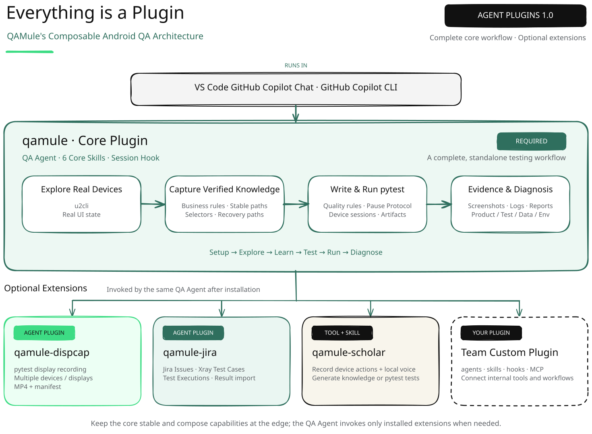
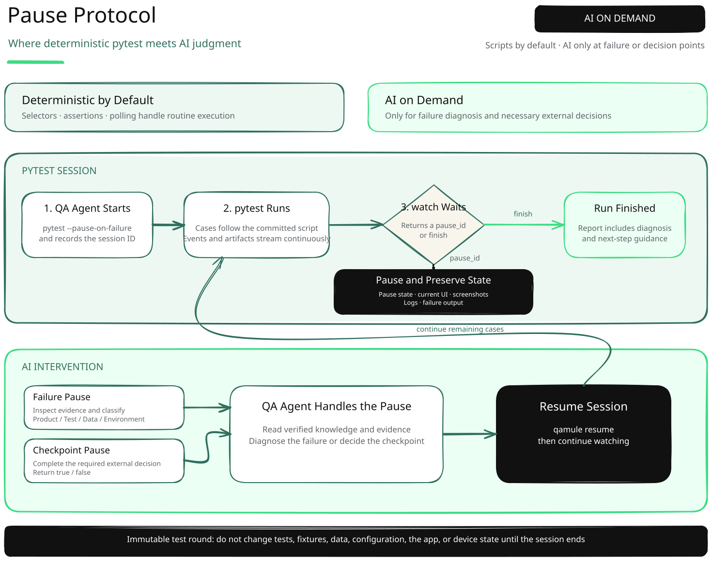
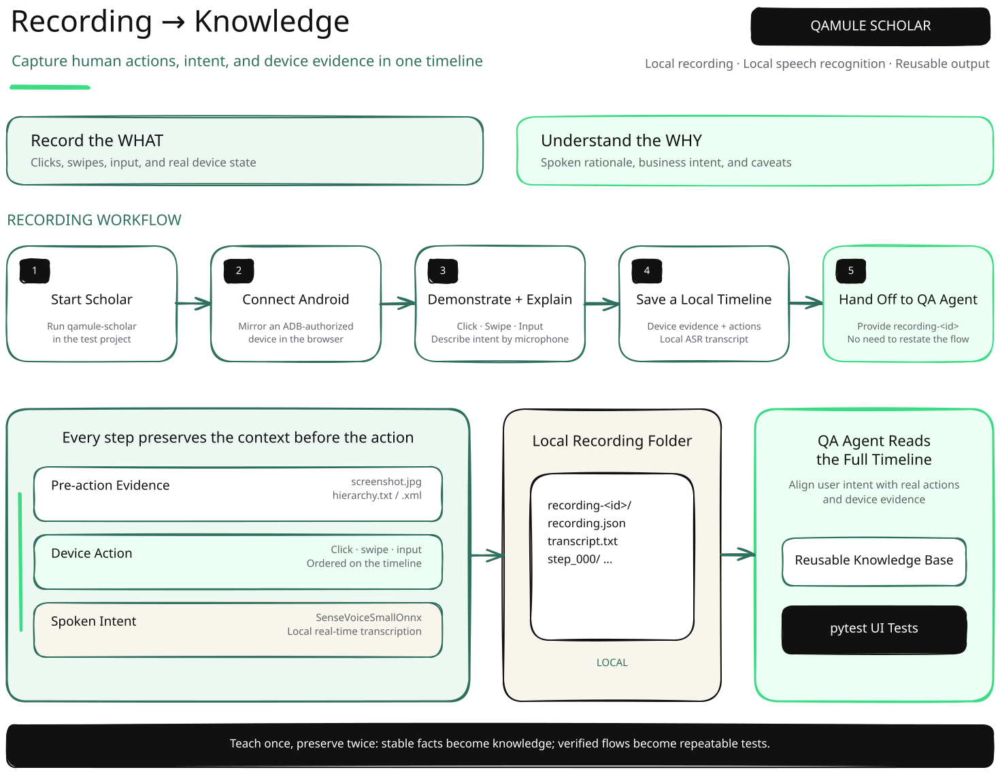

<p align="center">
  
</p>

<p align="center" style="font-size: 24px; font-weight: 600;">AI-Native Android QA Solution</p>

<div align="center">

[![MIT License][license-badge]][license]
![GitHub Copilot for VS Code and CLI][copilot-badge]
![Android testing][android-badge]

</div>

<p align="center">
  English | <a href="./README_ZH.md">简体中文</a>
</p>

<p align="center">
  <a href="#what-is-qamule"></a>
  &nbsp;&nbsp;
  <a href="#quick-start"></a>
</p>

---

## What is QAMule?

QAMule is a suite of open-source agent plugins that runs in **GitHub Copilot Chat for VS Code** or **GitHub Copilot CLI**. Simply describe the user behavior you want to verify, and QAMule can help you explore a real device, turn autonomous exploration and narrated human demonstrations into reusable knowledge, write and run pytest UI tests, preserve the state at the point of failure, and use evidence to determine whether an issue lies in the product, test, data, or environment.

**QAMule follows [Agent Plugins 1.0](https://github.blog/changelog/2026-08-12-agent-plugins-1-0-in-vs-code-copilot-cli-and-the-copilot-app/), with every capability delivered as a plugin. The core plugin provides the complete foundational testing workflow, while extensions for recorded teaching, test video capture, Jira/Xray integration, and more are available as independent plugins. Install only what you need, or build your own plugins to adapt QAMule to your team's tools and workflows.**

<p align="center">
  
</p>

## Why QAMule?

QAMule does not ask AI to guess at scripts without observing the real application, nor does it require a multimodal model to reinterpret the entire workflow on every test run. It first interacts with the device, confirms business rules, UI states, and stable paths through autonomous exploration or human demonstrations, and then captures those verified facts in a knowledge base and pytest scripts.

| Approach | How it works | Typical cost |
| --- | --- | --- |
| Traditional test automation | People explore, write scripts, and maintain them | Reliable and repeatable, but with significant upfront development and ongoing maintenance costs |
| AI-generated test scripts | Code is generated from requirements and available context | Faster implementation, but without real exploration it can easily guess at UI details, selectors, or workflows |
| Pure multimodal AI testing | A model observes, reasons, and acts on every run | Adaptable, but repeatedly consumes time and tokens, with less consistent execution |
| QAMule | Explore and capture knowledge first, then encode stable workflows in pytest | Knowledge and scripts remain reusable; AI is involved only for exceptions or necessary decision points |

The knowledge base means later tasks do not need to understand the application from scratch, while deterministic pytest scripts handle routine execution and reduce token usage and test time. Scripts that pass normally remain unchanged. When a failure reveals a change in the product, workflow, or environment, AI uses the evidence from the scene to decide whether the knowledge or scripts need updating instead of regenerating code on every run.

QAMule's custom **Pause Protocol** connects deterministic execution with AI judgment. A test can pause on failure while preserving the scene, or pause at a checkpoint that genuinely requires an external decision. AI can inspect evidence during the run, make a decision, and resume execution. Failure scenes are used only for diagnosis; script updates wait until the current test run has finished so they do not alter the scene or interfere with subsequent cases.

## Star Features

### Pause Protocol

Traditional test automation excels at executing predefined steps, but it struggles with moments of uncertainty during a run. A test usually runs from start to finish and leaves behind only pass/fail results and limited static artifacts. This creates several problems:

- **Failure context is easily lost**: By the time investigation begins, the device UI, temporary state, or surrounding context may have changed. An error and screenshot alone may not reveal whether the problem comes from the product, script, data, or environment.
- **External judgment is difficult to incorporate**: Some checkpoints genuinely require business semantics, visual information, or external state. Hard-coding these decisions makes scripts brittle, while requiring a person to supervise every run defeats the purpose of automation.

The Pause Protocol establishes a **resumable collaboration point** between pytest and AI. Under normal conditions, pytest executes a fixed script quickly and deterministically without AI involvement. Only an exception or a declared decision point causes the test to pause and wait for intervention. The complete workflow is shown below:

<p align="center">
  
</p>

The purpose of the protocol is not to let AI take over a test at any time, but to draw a clear boundary between execution and judgment. Work that can be completed deterministically always remains in the script; AI intervenes only when the available information is most valuable. A failure pause is used solely to collect evidence and identify the cause. Any required knowledge-base or script updates happen only after the current test run ends. This preserves the speed, repeatability, and auditability of traditional test automation while adding AI's ability to understand real failure scenes, without continuously paying the cost of multimodal reasoning for passing tests.

### Learning from Recordings

> QAMule Scholar requires the separate `qamule-scholar` plugin. After installing it, run `/qamule-scholar start` to start the recording service. On first launch, you will need to approve the installation of a local speech-to-text model.

The hardest part of sharing a complex testing workflow is often not *where to tap*, but *why*: which preconditions must be satisfied, how to identify the current state, which branches are exceptional, and how to recover from special cases. Requirements documents tend to omit this tacit knowledge, while an ordinary screen recording shows only the actions and leaves people or AI to infer the business intent and its relationship to UI elements.

**QAMule Scholar** mirrors an ADB-authorized Android device in a local browser. A tester can demonstrate a real workflow while using a microphone to explain business intent, decision criteria, and caveats; a local model transcribes the narration. Scholar organizes the actions and narration on a single timeline and saves the pre-action screenshot and UI hierarchy for every interaction. The result is not merely a video to replay, but structured evidence that both people and agents can understand:

- The **action timeline** records what actually happened and in what order.
- The **speech transcript** captures business intent, rules, and exceptions that the UI cannot express.
- **Screenshots and UI hierarchies** anchor every step to the real interface state and help identify stable elements.

<p align="center">
  
</p>

After recording, simply give the `qamule-scholar/recording-<id>` directory to the QA Agent. The Agent can extract business rules, task steps, screen relationships, and recovery paths verified by real interactions, store them in the knowledge base, and then write or update pytest tests. The same workflow no longer needs to be explained repeatedly, nor does AI need to reason through the video or UI from scratch every time, reducing communication, token, and maintenance costs.

Scholar does not replace QAMule's autonomous exploration. The Agent still explores ordinary workflows that can be verified directly through the UI. Use Scholar when complex business semantics, human judgment criteria, or domain expertise cannot be inferred from the interface and need to be injected accurately into the testing system.

### Repository-Level Knowledge Base

QAMule's knowledge base is neither invisible "memory" inside a model nor data stored in a user's home directory. It consists of reviewable, version-controlled Markdown documents stored alongside the test code under `knowledge-base/` at the repository root. The exact storage conventions are defined by the [`knowledge-base` skill](./plugins/qamule/skills/knowledge-base/SKILL.md): knowledge about the primary application belongs in `app/`, while knowledge about system or third-party dependencies belongs in `deps/`; business rules, task workflows, screen elements, and exception recovery paths are stored in `domains/`, `tasks/`, `screens/`, and `quirks/`, respectively. Each document covers one topic, declares its purpose through the frontmatter fields `name`, `description`, and `tags`, and contains only verified, reusable facts that can inform future decisions.

At the start of a session, the project runs the [context injection script](./plugins/qamule/scripts/inject-session-context.py) through a [`sessionStart` hook](./plugins/qamule/hooks/hooks.json). The script scans `knowledge-base/**/*.md`, but it does not inject every document body into the context. Instead, it injects a lightweight catalog built from file paths and frontmatter, letting the model know what verified knowledge exists in the repository and what each document is for.

When a testing task arrives, the model uses the current objective and this catalog to select candidate documents, follows the usage rules in the `knowledge-base` skill, and reads only the relevant content. Unrelated knowledge is not loaded, and newly discovered facts are written back to the repository only after they are confirmed to be reusable. This model of "automatic catalog injection, on-demand document loading" allows knowledge to evolve with the codebase without consuming ever more context and tokens as the knowledge base grows.

## Quick Start

### 1. Prepare Your Environment

Before you begin, make sure [GitHub Copilot Chat for VS Code](https://code.visualstudio.com/docs/copilot/chat/copilot-chat) or [GitHub Copilot CLI](https://docs.github.com/copilot/concepts/agents/copilot-cli/about-copilot-cli) is installed and authenticated. You will also need [`uv`](https://docs.astral.sh/uv/), Android Platform Tools, and a physical Android device or emulator accessible through ADB.

### 2. Install QAMule

First add the QAMule Marketplace, then install the core plugin:

```bash
copilot plugin marketplace add lanbaoshen/QAMule
copilot plugin install qamule@qamule
```

You only need to add the Marketplace once. For future updates or use in other projects, you can install the QAMule plugin directly.

### 3. Create a Test Project

Create an empty directory and open it as your test project. In VS Code, select **QA** from the Agent dropdown in Copilot Chat. With GitHub Copilot CLI, run `copilot` in that directory and then select the **QA** Agent.

### 4. Initialize the Project

Run the following command in the chat box:

```text
/qamule setup
```

QAMule creates the base project structure and `qamule.lock`, then installs core dependencies such as `pytest`, `qamule-pytest`, and `uiautomator2`.

### 5. Choose the Next Step

After initialization, the QA Agent recommends a next step based on the current project. You can select an option and continue directly, for example:

- Install optional extensions such as `qamule-scholar`, `qamule-dispcap`, or `qamule-jira` as needed.
- Build a reusable knowledge base from existing documentation or a Scholar recording.
- Connect a device and let the QA Agent explore the target application to confirm its UI structure, operation paths, and test preconditions.

### 6. Submit Your First Test Task

Tell the QA Agent the target application, device, starting state, and expected result. For example:

```text
Test com.example.shop on emulator-5554:
When a signed-in user adds an item to the cart, the cart count should increase by 1.
Explore the real UI first, then write and run the test. If it fails, preserve the evidence and determine the cause.
```

You do not need to provide coordinates or exhaustive steps in advance. QAMule first gathers information from the real UI, then captures knowledge and generates a repeatable test. It asks follow-up questions only when a critical precondition cannot otherwise be established.

## License

QAMule is open source under the [MIT License](./LICENSE).

[license]: ./LICENSE
[license-badge]: https://img.shields.io/badge/license-MIT-2f6f5e
[copilot-badge]: https://img.shields.io/badge/GitHub%20Copilot-VS%20Code%20%2B%20CLI-111111
[android-badge]: https://img.shields.io/badge/testing-Android-3ddc84
