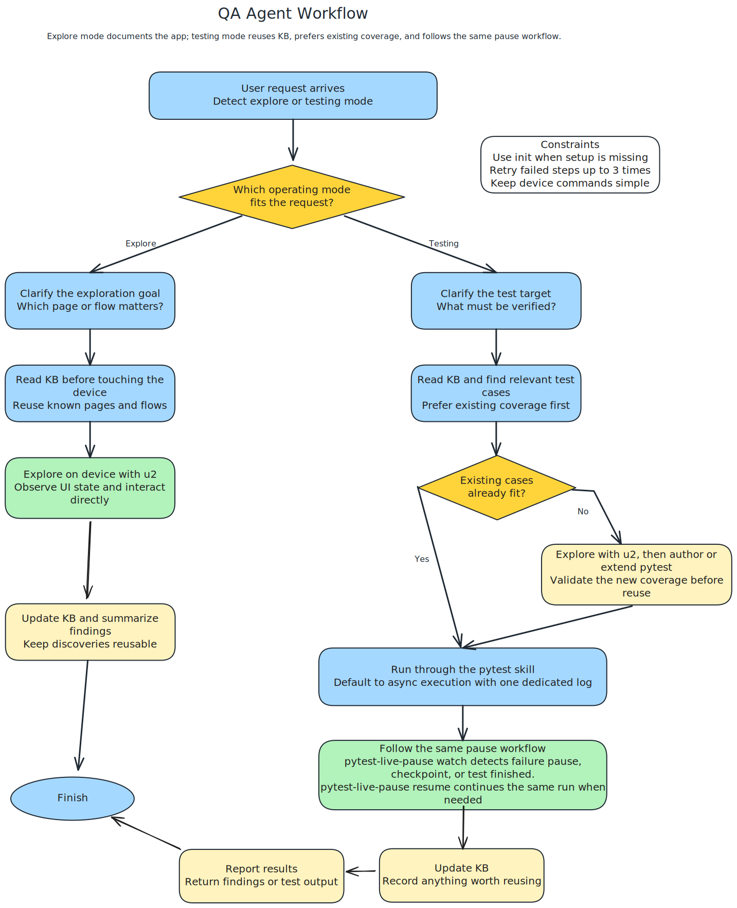
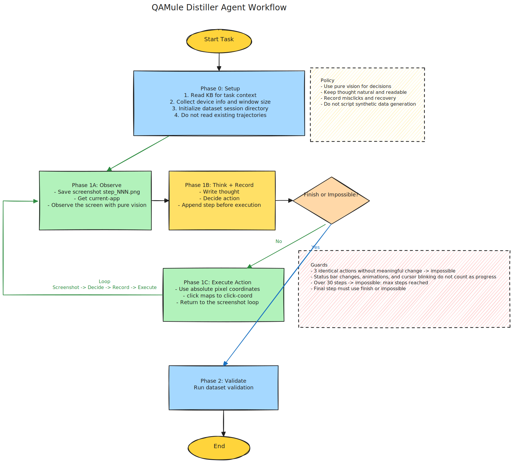

<p align="center">
  
</p>

<h1 align="center">QAMule</h1>

<p align="center">
  Agent 原生的 Android 测试框架 —— Agent 本身就是测试员。
</p>

<p align="center">
  <a href="README.md">English</a> •
  <a href="#快速开始">快速开始</a> •
  <a href="#工作原理">工作原理</a> •
  <a href="https://github.com/lanbaoshen/QAMule-Practice">实践参考</a> •
  <a href="LICENSE">MIT License</a>
</p>

---

## 这是什么？

QAMule 是一个 **Agent 优先** 的 Android QA 框架。它不是让 AI 帮你生成脚本，而是让 **AI Agent 直接操作设备完成测试**。脚本依然重要，但它不再是测试前提，而是验证成功后的加速缓存。

它的关键不是“用 AI 辅助自动化”，而是把测试入口从脚本切换成 Agent，把长期复用能力沉淀到 KB、pytest 和 dataset 中。

**范式转变：**

| | 传统 TA | QAMule |
|---|---|---|
| **核心执行者** | 脚本 | AI Agent |
| **AI 的角色** | 生成/维护脚本 | 直接执行测试 |
| **脚本** | 必须先有 | 可选，用于加速回放 |
| **失败处理** | 快照，失败环境丢失 | 保留失败现场，供 Agent 诊断并尝试恢复 |
| **新场景** | 先补脚本，再验证 | 直接探索并测试 |
| **知识沉淀** | 分散在脚本和人脑里 | 持续写入 KB，供 Agent 复用 |

## 核心亮点

1. **Agent 直接下场测试。** 面对新页面、新流程、新功能，QAMule 的第一反应不是先补脚本，而是先让 Agent 去看、去试、去验证。这让它天然适合需求变化快、回归跟不上、探索成本高的 Android 场景。

2. **QA 和 Distiller 分工明确。** QA Agent 负责探索、验证、回归、问题复现，以及在成熟场景中沉淀 pytest 脚本；Distiller Agent 负责采集真实视觉交互轨迹，生成 VLM 训练数据。两个 Agent 输出不同，但共享同一份 KB。

3. **KB 让经验真正能复用。** 页面、元素、流程、依赖应用和异常行为会持续写入 `kb/`。一次探索不只完成当前任务，也会为后续 QA 和 Distiller 提供上下文。

4. **脚本是成功经验的缓存层。** pytest 不是测试入口，而是稳定场景的沉淀结果。Agent 负责面对变化，脚本负责低成本回归，两者前后配合。

5. **失败现场会被保留下来。** QAMule 通过 pause-on-failure 冻结失败现场，让 Agent 在 teardown 前继续观察、分析，并在可能时尝试恢复，而不是只依赖事后日志。

## 快速开始

### 前置条件

- Android 设备通过 USB 连接，或使用模拟器
- UV，用于管理 Python 环境与依赖
- ADB，Android Debug Bridge

### 安装

1. 把 QAMule 作为 agent 插件安装到你的项目中：

```bash
# Github Copilot
copilot plugin marketplace add lanbaoshen/agent-plugins
copilot plugin install QAMule@lanbaoshen

# Claude Code
/plugin marketplace add lanbaoshen/agent-plugins
/plugin install QAMule@lanbaoshen

# VSCode
# command + shift + p -> "Chat: Install plugin from Source" -> "lanbaoshen/agent-plugins"
```

2. 初始化项目结构：

```text
/qamule:init
```

这会复制配置文件，创建骨架，并安装基础依赖。

### 使用

**探索一个页面：**
```text
@QAMule QA 探索设置页面
```

**测试一个功能：**
```text
@QAMule QA 测试 Settings 中的蓝牙开关是否正常
```

**采集一条训练轨迹：**
```text
@QAMule Distiller 在 com.android.settings 中打开蓝牙
```

**更新知识库：**
```text
/qamule:kb 该应用只能通过 UI 启动
```

**查询知识库：**
```text
/qamule:kb 如何查询系统版本
```

**查看已有测试覆盖：**
```text
/qamule:testcase 现在覆盖了哪些功能点
```

**预览数据集：**
```text
/qamule:dataset 预览数据集
```

## 工作原理

### QA Agent —— 以测代写

QA Agent 执行的是一个类人的测试闭环：

```text
观察 → 计划 → 执行 → 验证 → 学习 → 记录
 ↑                                      |
 └──────────────────────────────────────┘
```

1. **观察**：截图并读取当前界面
2. **计划**：结合目标和 KB 判断下一步动作
3. **执行**：发出一条设备命令
4. **验证**：确认动作是否产生预期效果
5. **学习**：把新发现写入 KB
6. **记录**：在合适的场景中生成 pytest 脚本，用于后续回归

脚本是成功测试后的**沉淀结果**，不是测试开始前的前置要求。



### Distiller Agent —— 为视觉模型采集真实轨迹

Distiller 只做一件事：**采集高质量、可复盘的真实设备交互轨迹**。

它以截图和当前 app 状态为主要观察输入，使用绝对坐标执行动作，并把截图、动作、思考、前台应用和结果逐步记录到 `dataset/`。它不负责生成 pytest 脚本，而是专注于保留真实交互过程，包括误操作、纠正、等待和恢复；同时它也会复用 KB 中已有的页面和流程知识来减少盲目试错。



### Knowledge Base —— 两个 Agent 的共享记忆

`kb/` 是 QAMule 的长期记忆层，保存页面信息、元素选择器、业务流程、依赖应用和已知 quirks。

- **QA Agent** 用它来减少重复探索、提高测试效率。
- **Distiller Agent** 用它来更快理解目标应用和上下文。

QAMule 的一个关键设计，不是让一个 Agent 同时产出所有东西，而是让不同 Agent 围绕同一份知识持续协作和积累，各自产出测试资产和数据资产。

### Agents

| Agent | 目的 | 产出 |
|-------|------|------|
| **QA** | 探索式测试、回归测试、问题复现 | KB 条目 + pytest 脚本 |
| **Distiller** | 训练数据采集 | 基于坐标的轨迹数据 |

### Skills

| Skill | 职责 |
|-------|------|
| **uiautomator2** | 内部设备操作技能，通过 `u2cli` 完成点击、滑动、输入、截屏、应用管理 |
| **kb** | 读写持久化应用知识：页面、流程、选择器、异常行为 |
| **pytest** | 内部 pytest 规范技能，定义脚本结构、fixture 约定、运行模式和 pause-on-failure 用法 |
| **testcase** | 在手动测试前检索已有用例，避免重复劳动 |
| **dataset** | 管理 VLM 训练轨迹：命名、Schema、可视化浏览 |
| **init** | 一次性项目脚手架搭建 |

## 设计理念

1. **Agent 即测试员。** AI 不是为别的系统写测试，而是自己直接执行测试。

2. **脚本是加速层，不是前提。** pytest 用来复用已验证行为，而不是限制测试只能从已有脚本开始。

3. **QA 与 Distiller 分工，而不是混做。** 一个负责测试资产，一个负责数据资产，各自产出不同结果。

4. **Knowledge Base 是协作层。** QA 和 Distiller 通过 KB 共享页面认知、流程知识和异常经验，减少重复探索。

5. **失败现场比日志更重要。** 问题发生时先保留状态，再让 Agent 现场分析，并在可能时尝试恢复。

## 适合什么团队

- Android 迭代快，脚本维护成本高
- 希望让 AI 真正参与测试执行，而不只是写代码
- 需要把测试过程沉淀成长期知识资产
- 同时关注工程测试与视觉操作模型数据积累

## 依赖

- [uiautomator2](https://github.com/openatx/uiautomator2) — Android 自动化库
- [uiautomator2-cli](https://github.com/lanbaoshen/uiautomator2-cli) — 为 Agent 使用设计的 CLI 封装
- [pytest](https://pytest.org/) — 结构化测试框架

## 许可证

[MIT](LICENSE) © 2026 Lanbao Shen
