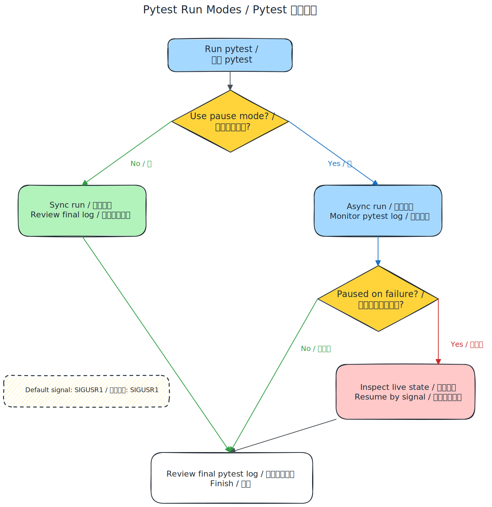

<p align="center">
  
</p>

<h1 align="center">QAMule</h1>

<p align="center">
  面向 Android 的 Agent 原生 QA 方案，Agent 本身就是主执行者。
</p>

<p align="center">
  直接在真机上探索和验证，保留失败现场，把稳定流程沉淀成 pytest，并持续积累可复用的产品知识。
</p>

<p align="center">
  <a href="README.md">English</a> •
  <a href="#你的第一位-ai-qa">你的第一位 AI QA</a> •
  <a href="#快速开始">快速开始</a> •
	<a href="#可扩展性">可扩展性</a> •
  <a href="#工作原理">工作原理</a> •
  <a href="https://github.com/lanbaoshen/QAMule-Practice">实践参考</a> •
  <a href="LICENSE">MIT License</a>
</p>

---

## 认识 QAMule

QAMule 是一个 **Agent 优先** 的 Android QA 框架，适合那些希望 AI **直接在真机上执行测试**，而不只是生成脚本的团队。

它不是从自动化代码开始，而是从真实界面的探索和验证开始。稳定行为再沉淀成 pytest 资产，过程中得到的页面认知和流程经验则持续写入 KB，供后续复用。

**范式转变：**

| | 传统 TA | QAMule |
|---|---|---|
| **核心执行者** | 脚本 | AI Agent |
| **AI 的角色** | 生成/维护脚本 | 直接执行测试 |
| **脚本** | 必须先有 | 可选，用于加速回放 |
| **失败处理** | 快照，失败环境丢失 | 保留失败现场，供 Agent 诊断并尝试恢复 |
| **新场景** | 先补脚本，再验证 | 直接探索并测试 |
| **知识沉淀** | 分散在脚本和人脑里 | 持续写入 KB，供 Agent 复用 |

## 为什么是 QAMule

1. **它能缩短从需求到测试的路径。** 面对新页面、不稳定流程和频繁变化的 UI，不需要先补脚本，Agent 就可以直接在真机上观察、操作和验证。

2. **它把测试与数据采集清晰分开。** QA 负责验证、回归和问题复现，Distiller 负责真实交互轨迹采集，两者共享同一份 KB，但职责不混在一起。

3. **它让每次运行都变成可复用的经验。** 页面、选择器、流程、依赖应用和 quirks 会持续写回 `kb/`，后续运行不必每次从零开始。

4. **它让脚本继续有价值，但不再成为瓶颈。** 稳定场景可以沉淀成 pytest 做低成本回归，变化仍然由 Agent 处理。

5. **它能保住最关键的失败瞬间。** pause-on-failure 会保留失败瞬间的现场，让 Agent 在 teardown 前继续观察，必要时现场恢复。

6. **它让 Agent 只在真正需要判断时介入。** 测试可以把一个边界清晰的 checkpoint 交给 Agent，用简单结果决定后续流程。

## 你的第一位 AI QA

如果把 QAMule 拟人化去理解，它很像一个刚加入团队的新 QA，只是这个 QA 直接活在设备和流水线里。

- 它会自己探索应用，认识页面、路径和异常状态。
- 它会把学到的内容写进 KB，逐步沉淀成可复用的测试知识。
- 它会自己完成验证任务；遇到稳定且重复的工作，再沉淀成 pytest 脚本来提效。
- 在暂停模式下，它更像一个站在流水线旁边实时盯结果、现场看失败的 QA。
- 对 Distiller 来说，它也像一个不会喊累的数据标注实习生，持续采集真机交互轨迹。

## 快速开始

只需要几条命令，你就可以探索页面、验证功能、采集真机轨迹，并把这次运行沉淀成后续可复用的知识。

### 前置条件

- Android 设备通过 USB 连接，或使用模拟器
- UV，用于管理 Python 环境与依赖
- ADB，Android Debug Bridge

### 安装

1. 把 QAMule 作为 agent 插件安装到你的项目中：

```bash
# GitHub Copilot
copilot plugin marketplace add lanbaoshen/agent-plugins
copilot plugin install QAMule@lanbaoshen

# Claude Code
/plugin marketplace add lanbaoshen/agent-plugins
/plugin install QAMule@lanbaoshen

# VS Code
# command + shift + p -> "Chat: Install plugin from Source" -> "lanbaoshen/agent-plugins"
```

2. 初始化项目结构：

```text
/qamule:init
```

这会初始化一个用于 QAMule 的基础 UV 项目，并安装核心依赖。

### 使用

**探索一个页面：**
```text
@qa 探索设置应用首页，识别主要功能区，并总结当前可操作元素
```

**测试一个功能：**
```text
@qa 验证 Settings 中的蓝牙开关能否正常打开和关闭，并报告任何异常系统行为
```

**采集一条训练轨迹：**
```text
@distiller 采集一条在 com.android.settings 中进入蓝牙设置页的真实设备交互轨迹
```

**在页面中查看数据集：**
```text
@distiller 在页面中查看当前数据集
```

**更新知识库：**
```text
/qamule:kb 记录该应用无法稳定通过 adb 拉起，必须通过应用内 UI 路径进入
```

**查询知识库：**
```text
/qamule:kb 当前设备上，查看 Android 系统版本的已知操作路径是什么？
```

### 失败暂停

启用后，pytest 会在失败后的 teardown 之前先暂停，让 Agent 直接查看当前现场，并在可能时尝试恢复。

这适合那些仅靠日志和截图还不够、仍然需要失败现场本身来判断问题的场景。

对于 Agent 驱动的 pytest 运行，建议使用 live pause 工作流：

1. 通过 `uv` 启动 pytest：
  ```bash
  uv run pytest [command/options]
  ```
2. 从 pytest 头部读取 `run_id`（例如 `pytest-live-pause: run_id={run_id}`），然后在另一个终端监控运行状态：
  ```bash
  uv run pytest-live-pause watch --run-id={run_id}
  ```
3. 当 `watch` 停止时，检查 `kind` 和 `pause_id`：
  - `checkpoint`：完成请求的外部任务后，用布尔结果恢复运行。
  - `failure`：先按 live-pause-failure-triage 流程检查现场，并结合 KB 判断这是前置缺失、环境干扰、脚本缺口、产品问题还是外部依赖问题，再携带结构化失败上下文恢复运行。
  - `run is no longer active`：表示运行已结束，不需要恢复。
4. 重复 `watch` 与 `resume`，直到整次运行结束。

live-pause-failure-triage 与 KB 的配合原则很简单：

- `pytest` 负责运行协议，例如如何 `watch`、何时 `resume`。
- `live-pause-failure-triage` 负责 live pause 中 failure 停顿的调研方法，例如先看什么、如何分类、如何决定 next action。
- `kb/` 负责项目事实，例如已知权限弹窗、登录前置、ROM 差异、依赖应用页面和恢复路径。

因此，失败暂停并不是看到阻塞就机械点掉，而是先判断它是否与当前测试目标相关，再查询 KB 中是否已有稳定知识可以帮助归因；只有当观察结果稳定、可复用时，才回写到 KB。

### Live 检查点

QAMule 也支持在测试正常进行时主动插入推理检查点。测试可以在一个判断点暂停，完成一个边界清晰的判断，然后继续执行。

`live_pause.checkpoint` 适合那些单靠本地断言不够稳的场景，例如判断过渡页面是否已可接受、视觉结果是否足够完整，或探索分支是否应算成功。

checkpoint 的约定保持得很简单：Agent 只返回布尔结果和可选原因，后续由测试自己决定如何继续。

不要把它用于可以通过选择器、文本断言、状态轮询或常规失败检查完成的验证。



## 可扩展性

通过 `/qamule:init` 生成的项目骨架，本身就是一个起点，而不是封闭系统。团队可以继续接入符合自己交付流程的额外 skill。

例如，如果你的 Agent 环境里已经提供了 Jira 相关 skill，就可以把它接入初始化后的项目，把 Jira 作为 QAMule 的测试用例平台来使用。在这种模式下，Jira 可以承担用例规划、执行范围管理和结果跟踪，而 QAMule 继续负责真机执行、KB 沉淀和 pytest 产物生成。

这样做的价值是，QAMule 可以适配已经有外部测试管理系统的团队，而不是要求所有用例管理都必须内置在框架里。

QAMule 也可以作为 AI Coding 流程中的验证环节存在。当 Agent 或 Coding Assistant 完成功能变更后，QAMule 可以接过验证步骤，直接在模拟器或真机上测试这次变更涉及的功能点。这样一来，代码生成和设备级验证就能被串成一个完整闭环，而不是停留在“代码已经产出”这一步。

这也让 QAMule 更容易接入 AI 驱动的研发流程，成为代码变更之后的设备侧验证环节，而不只是一个独立存在的测试框架。

## 工作原理

QAMule 不是把所有事情都塞给一个 Agent。它把测试执行、数据采集和知识沉淀拆成不同角色，让一次运行既能解决眼前问题，也能留下后续可复用的资产。

### QA Agent

QA 是产品验证的执行层，它的工作方式可以概括成一个简单闭环：

```text
观察 → 计划 → 执行 → 验证 → 学习 → 记录
 ↑                                      |
 └──────────────────────────────────────┘
```

1. **观察**：截图并读取当前界面
2. **计划**：结合目标和 KB 判断下一步动作
3. **执行**：发出一条设备命令
4. **验证**：确认动作是否产生预期效果
5. **学习**：把新发现写入 KB
6. **记录**：在合适的场景中生成 pytest 脚本，用于后续回归

核心点很直接：测试从真实产品开始，只有当行为已经足够稳定、值得复用时，才进一步沉淀成脚本。


### Distiller Agent

Distiller 是数据层，专注于**为视觉模型采集可复盘的真实设备交互轨迹**。

它会把截图、动作、思考、前台应用和结果记录到 `dataset/`。它不生成 pytest 脚本，而是负责保留真实交互过程，包括误操作、纠正、等待和恢复，让团队可以基于真实设备上的实际行为构建训练数据。


### Knowledge Base

`kb/` 是两个 Agent 共用的长期记忆层，保存页面信息、元素选择器、业务流程、依赖应用和已知 quirks。

- **QA Agent** 用它来减少重复探索、提高测试效率。
- **Distiller Agent** 用它来更快理解目标应用和上下文。

这也是 QAMule 能持续复利的原因：一次运行既完成当前任务，也会给下一次运行留下上下文。

### Agents

| Agent | 目的 | 产出 |
|-------|------|------|
| **QA** | 探索式测试、回归测试、问题复现 | KB 条目 + pytest 脚本 |
| **Distiller** | 训练数据采集 | 基于坐标的轨迹数据 |

### Skills

| Skill | 职责 |
|-------|------|
| **uiautomator2** | 内部设备操作技能，通过 `u2cli` 完成点击、滑动、输入、截屏、应用管理 |
| **kb** | 读写持久化应用知识：页面、流程、选择器、异常行为 |
| **pytest** | 内部 pytest 运行技能，定义运行模式、设备绑定、pause-on-failure 和 live checkpoint 工作流 |
| **live-pause-failure-triage** | 内部失败调研技能，只用于 live pause 的 `failure` 停顿，在该场景下结合 KB 调查现场、分类原因并生成结构化 resume reason |
| **pytest-authoring** | 内部 pytest 编写技能，定义 testcase 边界、marker 约定、fixture scope、参数化 |
| **dataset** | 管理 VLM 训练轨迹：命名、Schema、可视化浏览 |
| **init** | 一次性项目脚手架搭建 |

## 设计理念

1. **Agent 就是执行者。** AI 不是先为另一个系统写测试，而是自己直接操作产品、完成测试。

2. **脚本是杠杆层，不是门槛。** pytest 用来复用已验证行为，而不是决定什么才能被测试。

3. **测试与数据采集从设计上就是分开的。** QA 负责测试资产，Distiller 负责轨迹数据。

4. **Knowledge Base 是协作层。** QA 和 Distiller 通过 KB 共享页面认知、流程知识和异常经验。

5. **现场状态比事后材料更重要。** 问题发生时先保留状态，再让 Agent 现场分析，并在可能时尝试恢复。

## 适合谁

QAMule 很适合那些希望 Android QA 能跟上产品迭代速度，同时又不放弃结构化回归价值的团队。

- Android UI 变化快、脚本维护总是落后的团队
- 希望让 AI 真正参与执行和验证，而不只是辅助写代码的团队
- 希望让探索式测试不断沉淀成可复用知识，而不是一次性消耗掉的团队
- 同时重视回归资产和真机轨迹数据积累的团队

## 依赖

- [uiautomator2](https://github.com/openatx/uiautomator2) — Android 自动化库
- [uiautomator2-cli](https://github.com/lanbaoshen/uiautomator2-cli) — 为 Agent 使用设计的 CLI 封装
- [pytest](https://pytest.org/) — 结构化测试框架
- [pytest-live-pause](https://github.com/lanbaoshen/pytest-live-pause) - pytest 插件，支持失败暂停和 live checkpoint 工作流
- [pytest-u2device](https://github.com/lanbaoshen/pytest-u2device) - pytest 插件，提供设备绑定和 uiautomator2 交互能力

## 许可证

[MIT](LICENSE) © 2026 Lanbao Shen
