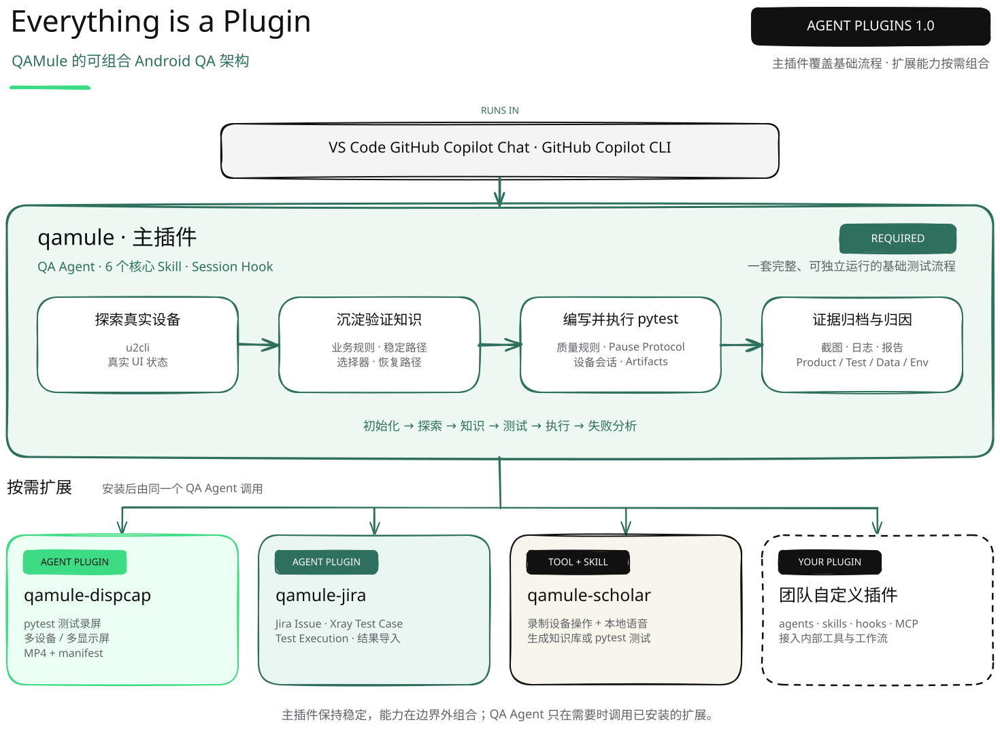
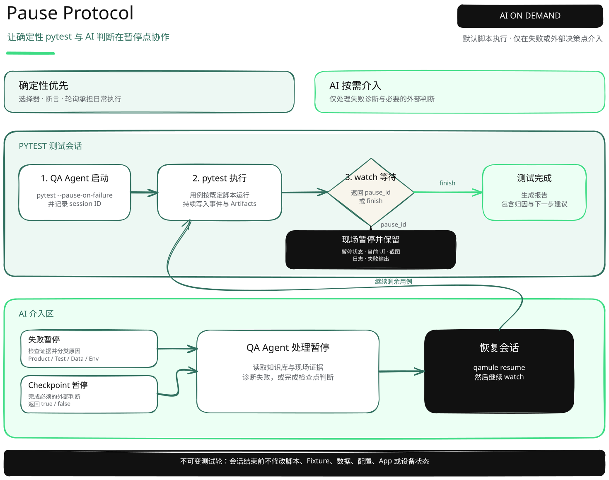
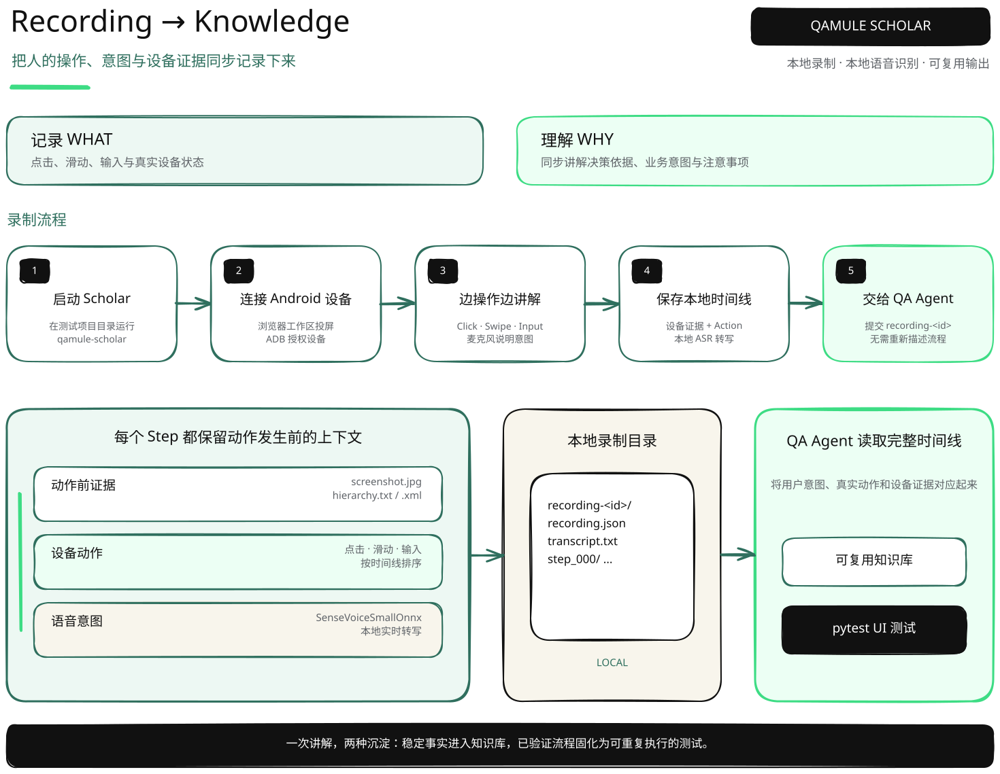

<p align="center">
  
</p>

<p align="center" style="font-size: 24px; font-weight: 600;">AI-Native Android QA Solution</p>

<div align="center">

[![MIT License][license-badge]][license]
![GitHub Copilot for VS Code and CLI][copilot-badge]
![Android testing][android-badge]

</div>

<p align="center">
  <a href="./README.md">English</a> | 简体中文
</p>

<p align="center">
  <a href="#qamule-是什么"></a>
  &nbsp;&nbsp;
  <a href="#快速开始"></a>
</p>

---

## QAMule 是什么?

QAMule 是一套开源的运行在 **VS Code GitHub Copilot Chat** 或 **GitHub Copilot CLI** 中的智能体插件。你只需说明要验证的用户行为，它便能协助你探索真实设备、将自主探索过程与人工操作讲解沉淀为可复用知识、编写和运行 pytest UI 测试、保存失败现场，并基于证据判断问题出在产品、测试、数据还是环境。

**QAMule 遵循 [Agent Plugins 1.0](https://github.blog/changelog/2026-08-12-agent-plugins-1-0-in-vs-code-copilot-cli-and-the-copilot-app/)，所有能力均以插件形式提供。主插件提供完整的基础测试流程；录制教学、测试录屏及 Jira / Xray 集成等扩展能力则由独立插件提供，用户可按需安装，也可自行开发插件，让 QAMule 适配团队特有的工具与工作流。**

<p align="center">
  
</p>

## 为什么选择 QAMule?

QAMule 不让 AI 脱离真实应用猜测脚本，也不让多模态模型在每次测试时重新理解整条流程。它先实际操作设备，通过自主探索或人工讲解确认业务规则、界面状态和稳定路径，再将验证过的事实沉淀为知识库与 pytest 脚本。

| 方式 | 工作模式 | 典型成本 |
| --- | --- | --- |
| 传统自动化测试 | 人工探索、编写并维护脚本 | 可靠且可重复，但前期编写和后续维护成本较高 |
| AI 编写测试脚本 | 根据需求和已有上下文生成代码 | 加快编码，但缺少真实探索时容易猜测界面、选择器或流程 |
| 纯 AI 多模态测试 | 每次运行都由模型观察、推理并操作 | 适应性强，但会重复消耗时间和 token，执行一致性也更难保证 |
| QAMule | 先探索并沉淀知识，再用 pytest 固化稳定流程 | 知识和脚本可持续复用，仅在异常或必要决策点引入 AI |

知识库让后续任务不必从头理解应用，确定性的 pytest 脚本则承担日常重复执行，从而减少 token 消耗和测试时间。正常通过的脚本保持不变；当失败暴露产品、流程或环境变化时，AI 才根据现场证据判断是否需要更新知识或脚本，而不是在每轮测试中重新生成代码。

QAMule 自定义的 **Pause Protocol** 将确定性执行与 AI 判断连接起来：测试可以在失败时暂停并保留现场，也可以在确实需要外部判断的检查点暂停。AI 可在测试中途检查证据、作出判断并恢复执行；失败现场只用于诊断，脚本更新留到当前测试轮结束后进行，避免改变现场或干扰后续用例。

## 明星功能

### 暂停协议

传统自动化测试擅长执行已经确定的步骤，却很难处理执行过程中的“不确定时刻”。测试通常从开始一直运行到结束，只留下通过、失败和有限的静态产物。这会带来几个问题：

- **失败现场容易错过**：等测试全部结束后再排查，设备界面、临时状态或上下文可能已经变化，仅凭报错和截图难以判断问题来自产品、脚本、数据还是环境。
- **外部判断难以接入**：有些节点确实需要结合业务语义、视觉信息或外部状态作出判断。将这些判断强行写成规则会让脚本变得脆弱，让人全程值守又失去了自动化的意义。

Pause Protocol 在 pytest 与 AI 之间建立了一个**可恢复的协作点**。正常情况下，pytest 按照固定脚本快速、确定地执行，AI 无须参与；只有出现异常或预先声明的决策点时，测试才暂停并等待处理。完整流程如下：

<p align="center">
  
</p>

协议的关键不是“让 AI 随时接管测试”，而是明确划分执行与判断：能确定性完成的工作始终交给脚本，AI 只在信息价值最高的时刻介入。失败暂停只用于收集证据和判断原因；需要更新知识库或脚本时，也要等当前测试轮结束后再处理。这样既保留了传统自动化测试的速度、可重复性和可审计性，又获得了 AI 对真实现场的理解能力，并避免为正常通过的测试持续支付多模态推理成本。

### 录制学习

> QAMule Scholar 需要额外安装 `qamule-scholar` 插件。安装后，通过 `/qamule-scholar start` 启动录制服务；首次启动时，需要确认安装本地 STT 模型。

复杂测试流程最难传递的往往不是“点哪里”，而是“为什么这样操作”：需要满足哪些前置条件、如何判断当前状态、哪些分支属于异常，以及遇到特殊情况应如何恢复。需求文档容易遗漏这些隐性经验，普通录屏又只能展示操作过程，后来的人或 AI 仍要重新猜测业务意图与界面元素之间的关系。

**QAMule Scholar** 将已通过 ADB 授权的 Android 设备投屏到本地浏览器。测试人员可以一边演示真实流程，一边通过麦克风讲解业务意图、判断依据和注意事项；讲解由本地模型转写。Scholar 会把操作与讲解组织成同一条时间线，并为每次操作保存操作前的截图和 UI 层级，因此得到的不是一段只能回看的视频，而是一份人和 Agent 都能理解的结构化证据：

- **操作时间线**记录实际执行了什么，以及操作发生的顺序；
- **语音转写**补充界面无法表达的业务意图、规则和例外；
- **截图与 UI 层级**锚定每一步的真实界面状态，并为定位稳定元素提供依据。

<p align="center">
  
</p>

录制完成后，只需将 `qamule-scholar/recording-<id>` 目录交给 QA Agent。Agent 可以从中提取经过真实操作验证的业务规则、任务步骤、界面关系和恢复路径，沉淀到知识库，再据此编写或更新 pytest 测试。相同流程以后无需反复解释，也不需要让 AI 每次从视频或界面中重新推理，从而降低沟通、token 和维护成本。

Scholar 并不取代 QAMule 的自主探索。界面能够直接验证的普通流程仍由 Agent 自行探索；当复杂业务语义、人工判断标准或领域经验无法从 UI 推断时，再用 Scholar 将人的知识准确地注入测试体系。

### 仓库级知识库

QAMule 的知识库既不是模型内部不可见的“记忆”，也不存放在用户的 Home 目录中，而是与测试代码一起保存在仓库根目录 `knowledge-base/` 下、可审查和版本管理的 Markdown 文档。具体存储约定由 [`knowledge-base` skill](./plugins/qamule/skills/knowledge-base/SKILL.md) 定义：主应用知识放在 `app/`，系统或第三方依赖知识放在 `deps/`；业务规则、任务流程、页面元素和异常恢复路径分别存入 `domains/`、`tasks/`、`screens/` 和 `quirks/`。每份文档只描述一个主题，并通过 frontmatter 中的 `name`、`description` 和 `tags` 标明用途，正文只保留经过验证、可复用且有助于后续决策的事实。

项目会在会话开始时通过 [`sessionStart` hook](./plugins/qamule/hooks/hooks.json) 运行[上下文注入脚本](./plugins/qamule/scripts/inject-session-context.py)。脚本扫描 `knowledge-base/**/*.md`，但不会把所有正文一次性塞入上下文；它只注入由文件路径和 frontmatter 组成的轻量目录，让模型知道仓库里有哪些已验证知识以及它们各自解决什么问题。

收到测试任务后，模型根据当前目标和这个目录自行选择候选文档，先遵循 `knowledge-base` skill 的使用规则，再按需读取相关正文。与任务无关的知识不会加载；新探索得到的事实也只有在确认可复用后才会写回仓库。这样的“目录自动注入、正文按需读取”机制既让知识能够随代码共同演进，又避免随着知识库增长而持续占用大量上下文和 token。

## 快速开始

### 1. 准备环境

开始前，请确保本机已安装并登录 [VS Code GitHub Copilot Chat](https://code.visualstudio.com/docs/copilot/chat/copilot-chat) 或 [GitHub Copilot CLI](https://docs.github.com/copilot/concepts/agents/copilot-cli/about-copilot-cli)，同时已安装 [`uv`](https://docs.astral.sh/uv/) 和 Android Platform Tools，并准备好一台可通过 ADB 访问的 Android 真机或模拟器。

### 2. 安装 QAMule

先添加 QAMule Marketplace，再安装主插件：

```bash
copilot plugin marketplace add lanbaoshen/QAMule
copilot plugin install qamule@qamule
```

Marketplace 只需添加一次。后续更新或在其他项目中使用时，可直接安装 QAMule 插件。

### 3. 创建测试项目

创建一个空目录并将它作为测试项目打开。在 VS Code 中，从 Copilot Chat 的 Agent 下拉菜单选择 **QA**；使用 Copilot CLI 时，在该目录运行 `copilot`，然后选择 **QA** Agent。

### 4. 初始化项目

在聊天框中运行：

```text
/qamule setup
```

QAMule 会创建基础项目结构和 `qamule.lock`，并安装 `pytest`、`qamule-pytest` 与 `uiautomator2` 等核心依赖。

### 5. 选择下一步

初始化完成后，QA Agent 会根据当前项目给出下一步建议。你可以直接选择一项继续，例如：

- 按需安装 `qamule-scholar`、`qamule-dispcap` 或 `qamule-jira` 等扩展插件；
- 根据已有文档或 Scholar 录制建立可复用的知识库；
- 连接设备，让 QA Agent 探索目标应用，确认界面结构、操作路径和测试前置条件。

### 6. 提交第一个测试任务

向 QA Agent 说明目标应用、设备、起始状态和期望结果。例如：

```text
在 emulator-5554 上测试 com.example.shop：
已登录用户把一件商品加入购物车后，购物车数量应增加 1。
请先探索实际界面，再编写并执行测试；失败时保留证据并判断原因。
```

无需预先提供坐标或完整操作步骤。QAMule 会先从真实 UI 获取信息，再沉淀知识并生成可重复执行的测试；只有关键前置条件无法确认时，才会追问完成任务所必需的信息。

## 许可证

QAMule 基于 [MIT License](./LICENSE) 开源。

[license]: ./LICENSE
[license-badge]: https://img.shields.io/badge/license-MIT-2f6f5e
[copilot-badge]: https://img.shields.io/badge/GitHub%20Copilot-VS%20Code%20%2B%20CLI-111111
[android-badge]: https://img.shields.io/badge/testing-Android-3ddc84
